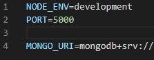
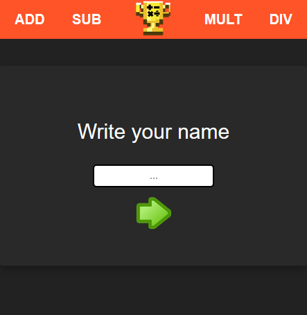
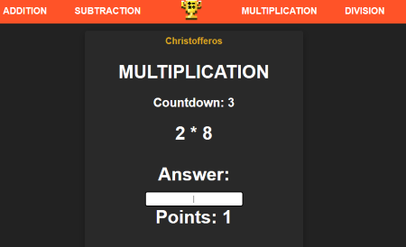

# MathRush
Allows the users to improve their mathematical calculation speed by doing exercises on basic operations. 

## How to run the website locally:
1. Clone down repo, cd into 'backend' folder.
2. Run the command: npm i && npm run client-install.
3. Add a file with name: 'config.env' in the config folder AND add these fields:  
  
(You will have to assign your own MONGO_URI to a local database here).
3. Run the command: npm run dev
4. Now the client should open up in localhost:3000 and server should run on localhost:5000.

### Preview images of the application

### Test the static version here (Without database)
https://christofferos.github.io/MathRush/

### Video showing the application:
#### Youtube:

 LINK: https://www.youtube.com/watch?v=COzfBStLJ-E

 
#### GIF

